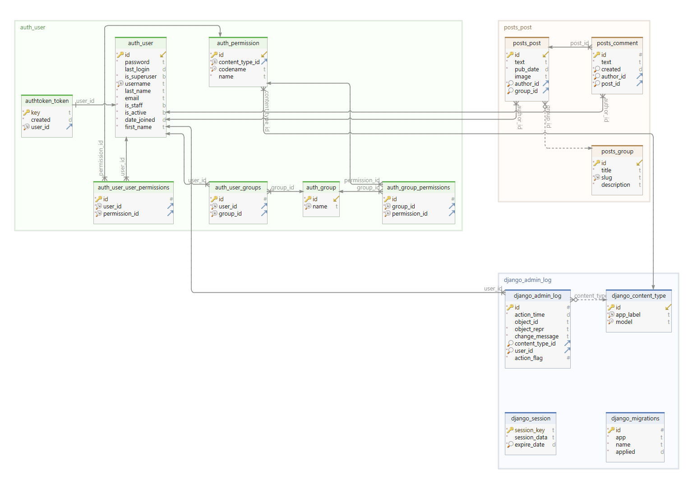

## Развёртывание проекта:
+ Клонировать репозиторий и перейти в него в командной строке:
```shell script
git clone git@github.com:Furturnax/api_yatube.git
```

```shell script
cd api_yatube/
```

+ Cоздать и активировать виртуальное окружение (Windows/Bash):
```shell script
python -m venv venv
```

```shell script
source venv/Scripts/activate
```

+ Установить зависимости из файла requirements.txt:
```shell script
python -m pip install --upgrade pip
```

```shell script
pip install -r requirements.txt
```

+ Перейти в директорию с manage.py:
```shell script
cd yatube_api/
```

+ Выполнить миграции:
```shell script
python manage.py migrate
```

+ Запустить проект:
```shell script
python manage.py runserver
```

<br>

## Схема базы данных:


<br>

## Порядок запросов к API:
Для работы понадобится программа **Postman**. Она существует в `desktop` и `web` версии. Она удобна функционалом. Либо использовать стандартный интерфейс `DRF` без установки дополнительного ПО. 

Запустить проект. По адресу http://127.0.0.1:8000/.

Зарегистрировать пользователя через Admin-панель.
+ Перейти в директорию с manage.py:
```shell script
cd yatube_api/
```

+ Создать пользователя-администратора:
```shell script
python manage.py createsuperuser
```

Получить TokenAuthentication через **Postman**.  
+ По адресу http://127.0.0.1:8000/api/v1/api-token-auth/, через `POST` запрос передать данные в формате `JSON`:
```
{
	"username": "username",
	"password": "password"
}
```

Авторизировать токен во вкладке **Headers**.
- В поле **Key** передать `Authorization`;
- В поле **Value** передать `Token <api_token>`;

<br>

### Примеры API запросов:
```
{
    "text": "Обязательное поле."
}
```
#### Posts:

- POST http://127.0.0.1:8000/api/v1/posts/ - добавить публикацию;
- GET http://127.0.0.1:8000/api/v1/posts/ - получить все публикации;
- GET http://127.0.0.1:8000/api/v1/{post_id}/ - получить публикацию с {post_id};
- PUT http://127.0.0.1:8000/api/v1/{post_id}/ - изменить публикацию с {id};
- PATCH http://127.0.0.1:8000/api/v1/{post_id}/ - изменить часть публикации с {post_id};
- DELETE http://127.0.0.1:8000/api/v1/{post_id}/ - удалить публикацию с {post_id};

#### Groups:

- GET http://127.0.0.1:8000/api/v1/groups/ - получить все группы;

#### Comments:


- POST http://127.0.0.1:8000/api/v1/posts/{post_id}/comments/ - добавить комментарий;
- GET http://127.0.0.1:8000/api/v1/posts/{post_id}/comments/ - получить все комментарии;
- PUT http://127.0.0.1:8000/api/v1/posts/{post_id}/comments/{comment_id}/ - изменить комментарий {comment_id};
- PATCH http://127.0.0.1:8000/api/v1/posts/{post_id}/comments/{comment_id}/ - изменить часть комментария {comment_id};
- DELETE http://127.0.0.1:8000/api/v1/posts/{post_id}/comments/{comment_id}/ - удалить комментарий {comment_id};
